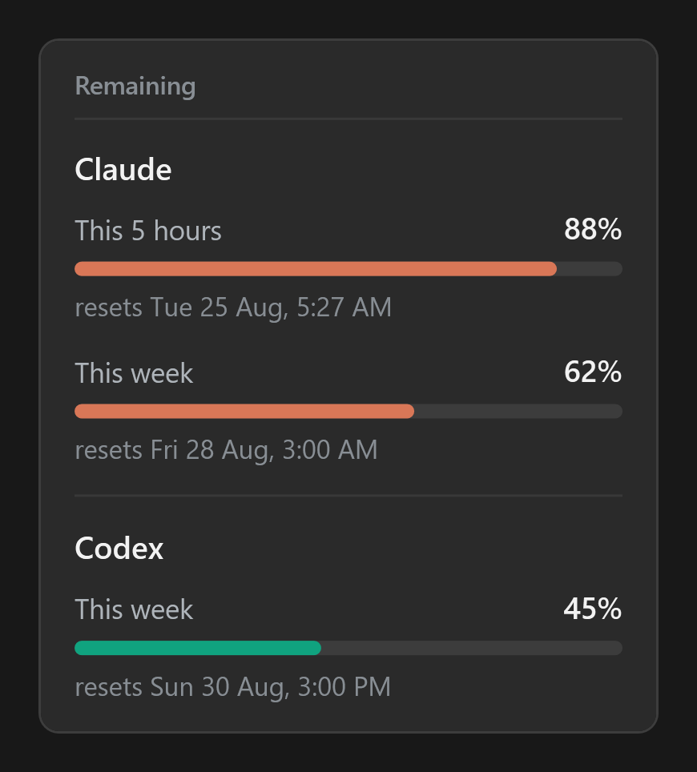

# Usage

**See how much Claude Code and Codex you have left, without stopping to check.**

Usage puts one short line of text on your Windows taskbar, just to the left of the clock:

```
Claude 45% · Codex 14%
```

Those numbers are how much you have **left**, not how much you have used. So 45% means you still have 45% of
your weekly allowance to spend.

That is the whole idea. The number sits somewhere you already look, so you stop guessing and you stop getting
surprised by a limit you did not see coming.

## What you get

**The line on the taskbar.** Always there. It updates itself every few minutes.

**Each number is coloured by how much is left**, so you can read it without really reading it:

| Left | Colour |
| --- | --- |
| 75% and up | light green |
| 25% to 75% | yellow |
| under 25% | red |

The green is a soft one on purpose. Most of the time nothing is wrong, and a taskbar that keeps announcing that
in bright green is a taskbar you stop looking at. Red is the one moment it wants your attention.

**Hover your mouse over it** and a small card appears with the detail:



Each bar is one limit. It shows how much is left and the exact time it refills.

Claude has two limits, so it gets two bars, shortest first:

- **This 5 hours** is a shorter limit that refills more often, roughly every five hours. It is the one most
  likely to stop you today, so it sits on top.
- **This week** is your weekly allowance.

Codex only reports a weekly limit, so it only gets one bar. Usage never invents a bar for something a provider
did not actually report.

**Right-click the line** for a small menu: the current numbers, **Show Claude** and **Show Codex** switches, a
**Refresh now** button, a **Start with Windows** switch, and **Quit**. Uncheck a provider and it leaves the
taskbar and the hover card. Check it again and it comes back. The choice survives a restart.

If a number cannot be read for some reason, Usage says so in words. It will never show you an old number and
pretend it is current.

## Install

1. Download `Usage-Setup-1.2.0.exe` from the
   [latest release](https://github.com/MeltTheManual/Usage-Taskbar/releases/latest).
2. Run it and follow the steps.

It is a normal Windows installer. It asks where you want the app, then it:

- puts the app in the folder you chose
- adds it to your Start Menu, so later you can press Start, type "Usage", and open it
- adds it to **Add or Remove Programs**, so you can uninstall it the normal Windows way

There is nothing else to download. .NET is built into the app itself, so you do not need to install a runtime or
any other extra piece.

By default it installs **just for you**, so Windows will not ask for administrator permission. If you would
rather install it for everyone who uses the PC, the installer offers that too, and then it goes into Program
Files.

### About the blue warning

When you run the installer, Windows will probably show a blue box saying the publisher is unrecognised.

That happens because the file is not code signed. Signing costs money every year, and this is a free side
project, so it is not signed. Click **More info**, then **Run anyway**.

If you would rather check before trusting it, the release notes list the file's SHA256, which is a fingerprint
of the exact file that was published. You can compare it with this in PowerShell:

```powershell
Get-FileHash .\Usage-Setup-1.2.0.exe -Algorithm SHA256
```

If the two match, the file you downloaded is exactly the one that was published.

### After installing

Usage starts automatically every time you sign in to Windows.

You can turn that off from the right-click menu, and it will stay off. It will not quietly switch itself back
on. If you ever want it again, open it from the Start Menu.

## There is nothing to set up

No settings window. No account, and no sign-in. The Show Claude and Show Codex ticks live on the right-click menu.

Usage reads the login that Claude Code and Codex already keep on your PC. If you are signed in to those tools,
it just works.

**If you only use one of them, the other simply does not appear.** No blank space, no error message, and no nag
telling you to install something you never wanted. If a login is there but you still do not want that provider
on the taskbar, uncheck it from the right-click menu. If neither one is on your PC, Usage says so once rather
than pretending it knows something.

It reads what the **currently signed in Windows user** has. So if two people share a PC, each of them sees only
their own numbers.

## Is it safe?

A fair question, and you should ask it. This app reads login files belonging to other programs. Here is the
straight answer.

**It reads exactly two files, and it only ever reads them:**

- `%USERPROFILE%\.claude\.credentials.json`
- `%USERPROFILE%\.codex\auth.json`

`%USERPROFILE%` means your own user folder. It is worked out while the app is running, on your machine. Nothing
about any other computer or account is built into the download.

**It sends your access token to exactly two addresses,** the same ones the official tools already use to check
your usage:

- `https://api.anthropic.com/api/oauth/usage`
- `https://chatgpt.com/backend-api/wham/usage`

**What it never does:**

- It never writes to those login files.
- It never refreshes, changes, or replaces your tokens.
- It never sends them anywhere except the two addresses above.
- There is no tracking, no analytics, and no server belonging to this project.

That read-only rule is not just a promise in a README. There is a test called `Never_writes_to_the_login_files`
that fails the build if any write is attempted. It also compares both login files byte for byte before and
after a full check, to prove nothing changed.

An earlier version did try to refresh tokens that looked expired, and that was removed on purpose. Anthropic
treats a refresh token as single use. Refreshing it here would have quietly broken the copy Claude Code was
holding, and could have signed you out of the tool you were working in. A program that is only watching does
not get to touch another program's login.

Usage also writes a small log to `%TEMP%\Usage.log`. It contains short status words and error types only. Never
tokens.

If you would rather check all this yourself than trust a README, that is exactly the right instinct. There is
not much to read: about 1,800 lines of actual program, plus its tests. Start with
`src/Usage.Core/RemainingClient.cs`, which is the only file that touches those login files or the network.

## What is tested, and what is not

Being honest about this matters more than looking polished.

This was written for one computer and then shared. It has only really been used on:

- Windows 11
- 100% display scaling
- a single monitor
- the taskbar along the bottom of the screen

**Not tested, and the most likely places it goes wrong:**

- display scaling at 125%, 150%, or anything other than 100%
- more than one monitor, because it follows your main taskbar only
- a taskbar placed on the left, the right, or the top
- Windows 10
- tools that replace the Windows taskbar, such as ExplorerPatcher or StartAllBack

The part most likely to break is **where the text is positioned**. If it lands in the wrong place, or you cannot
see it at all, please open an issue and say which of the above applies to you. Right now that is genuinely the
most useful bug report anyone can send.

## Uninstall

Open **Add or Remove Programs** in Windows Settings, find Usage, and remove it. You can also run the uninstaller
inside the install folder.

It cleans up after itself completely: the program files, the Start Menu shortcut, the start-with-Windows entry,
and its small settings folder at `%LOCALAPPDATA%\Usage`.

Your Claude Code and Codex logins are left exactly as they were, because Usage never changed them in the first
place.

## Build it yourself

You need the [.NET 10 SDK](https://dotnet.microsoft.com/download).

```powershell
dotnet test Usage.sln -c Release             # run the tests
powershell -File scripts\Publish-Usage.ps1   # quick build, for working on the code
powershell -File scripts\Publish-Release.ps1 # the single self-contained exe
powershell -File scripts\Build-Installer.ps1 # the installer that people download
```

- `Publish-Usage.ps1` makes a small build in `dist\`. It needs .NET already installed in order to run.
- `Publish-Release.ps1` makes the one large `Usage.exe` in `out\release\`, with .NET packed inside it, and
  prints its SHA256.
- `Build-Installer.ps1` rebuilds that exe and then wraps it using
  [Inno Setup](https://jrsoftware.org/isinfo.php). You need Inno Setup first:
  `winget install --id JRSoftware.InnoSetup -e`.

**About `installer/Usage.iss`:** that file is not the installer. It is the recipe for building one. `.iss`
stands for Inno Setup Script, and it lists what to install, where to put it, which shortcuts to create, and
what to clean up when someone uninstalls. The finished installer is the `.exe` on the releases page. Program
files do not belong in a code repository, so the recipe lives here and the result lives there.

Two extra tools that help when changing things:

```powershell
# Print the readings once and exit. The fastest way to tell a bad reading from a bad display.
dotnet run --project src\Usage.Probe\Usage.Probe.csproj -c Release

# Save the hover card as an image, so you can work on its design without holding the mouse still on a tooltip.
out\release\Usage.exe --card-preview card.png           # your real numbers
out\release\Usage.exe --card-preview card.png --sample  # made up numbers, for screenshots

# Stop a running copy from anywhere. The installer uses this, so it never has to force-kill anything.
Usage.exe --quit
```

## How it works inside

Useful if you want to change something.

**Two processes, on purpose.** One draws the line of text (`--ui`). The other does nothing except restart it if
it ever dies (`--watch`). Seeing two `Usage` entries in Task Manager is normal, not a bug.

**It is a floating window, not a tray icon.** Notification-area icons were tried first and rejected, because
Windows hides them behind the little arrow, and an icon cannot show two changing numbers.

**It does not care where it is installed.** It works out its own location from the running file. Anything it
writes goes to `%LOCALAPPDATA%\Usage`, never next to the program itself. That is what lets it behave the same
whether it sits in Program Files or in your own user folder.

### One trap, if you touch the window code

The Windows taskbar is also an "always on top" window. Being always on top is a group, not a ranking inside that
group. Every time a full-screen app opens or closes, Windows pushes the taskbar back above everything else in
that group, including our text.

So the text does not stop drawing. It gets **buried underneath the taskbar**. That looks exactly like a drawing
bug, and it is not one. `RaiseAboveTaskbar` fixes it by re-claiming its position four times a second.

Also: never set that always-on-top style using `SetWindowLongPtr` and trust the result. It reports the style
back to you as though it worked, while actually doing nothing. That one detail caused four wrong diagnoses in a
row.

## Contributing

Issues and pull requests are welcome. Two things make a change much easier to accept:

- **Keep it read-only.** The app must never write to the login files. This one is not up for discussion, and
  there is a test that will stop you anyway.
- **Never show a number that might not be true.** If a reading fails, saying so honestly is the feature, not a
  fallback.

Please check that `dotnet test Usage.sln -c Release` passes before and after your change.

## Support

This was built for one person's own machine and shared in case it is useful to someone else. It is a side
project, not a product with a support team, so replies may be slow and some things may never get fixed.

Bug reports are still genuinely welcome, especially about the untested setups listed above.

## License

MIT, which means you can use, change, and share it freely. See [LICENSE](LICENSE).
